# prowler-securityhub-jira-integration
Automates sending Prowler findings to AWS SecurityHub and Jira for streamlined security management. 🚀

## Step By Step Setup: 

### Prerequisites:

* ***Jira API Access:*** You need a Jira account, API token, and the project key where issues will be created.

* ***Terraform:*** For automating Lambda deployment.
* Before running the Lambda function, ensure you have security hub and Prowler enable:
- AWS Security Hub: Configured and enabled in the regions you are monitoring.
#### Follow below steps for single account setup:

step 1: open aws security hub from console.

step 2: Click on “Go to Security Hub”.

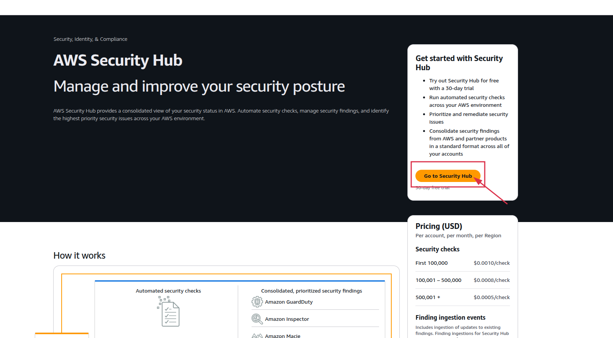
Step 3: Then enter Delegated Administrator AWS account ID and click on enable Security Hub.

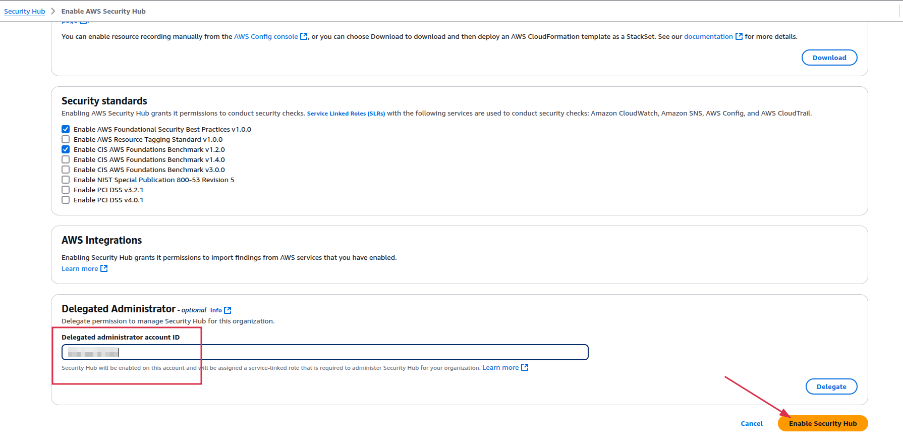

step 4: Then click on integrations from left panel.

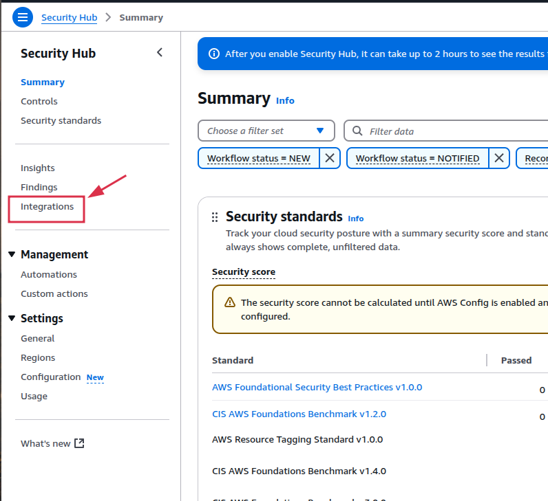

step: 5 In search bar, search for “Prowler“. and then click on “accept findings“.

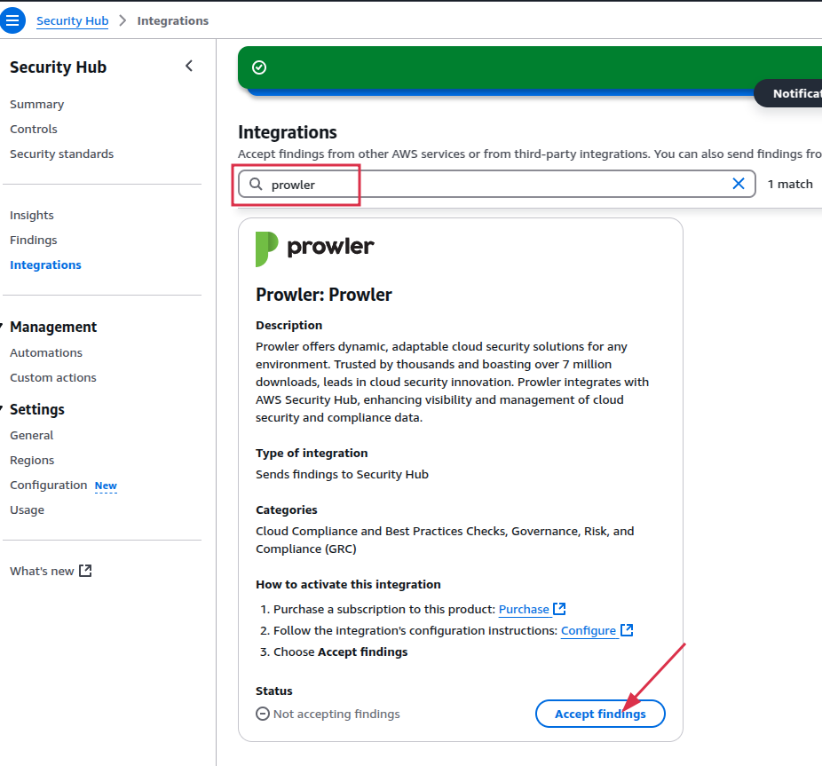

#### For Multiple account setup, follow below steps using workflow:

* checkout code for workflow at `.github/workflows/multi-account-setup.yaml`
* About Code: 

    1. Check out code

        * Uses actions/checkout@v4 to clone the repository code to the runner

    2. Configure AWS credentials with OIDC

        * Uses AWS's credential action to authenticate via OpenID Connect

            a. add arn of root account .

        * Assumes a specific IAM role with session name "github-actions"

        * Sets default AWS region to us-east-1, change as per your need.

    3. Installing Prowler Dependencies

        * Updates apt packages

        * Installs zip, unzip, and python3-pip

        * Removes python3-urllib3 (likely to avoid version conflicts)

        * Installs Prowler and various Python libraries

        * Verifies Prowler installation

        * Increases file handle limit for the scan

    4. Run Prowler Scan for Multiple Accounts


        * Loops through four AWS account IDs

            * add account IDs of all account you want to setup for.


        * For each account:

            a. Assumes a role called "prowler-security-hub", assume role must be in security account where you want to send all accounts findings.

            b. Runs Prowler with JSON-ASFF output format

            c. Sends findings directly to AWS Security Hub 

                -  mention all account ids in loop.

            d. Ignores exit code 3 (likely non-critical errors/warnings)

            e. Logs completion message

- Run the workflow by trigger it manually (workflow_dispatch).

### Terraform Code Deployment: 

- checkout to the terraform directory:

```bash
 cd terraform
```
- Initialize Terraform:

```hcl
terraform init
```

- Plan the Deployment:

``` hcl
terraform plan
```

- Apply the Configuration:

```hcl
terraform apply
```
### Testing and Validation:
- First test , if all aws resources created successfully and configured. For that we can check for following:

    - Iam role, policies and Trust Relationship policy attached properly.

    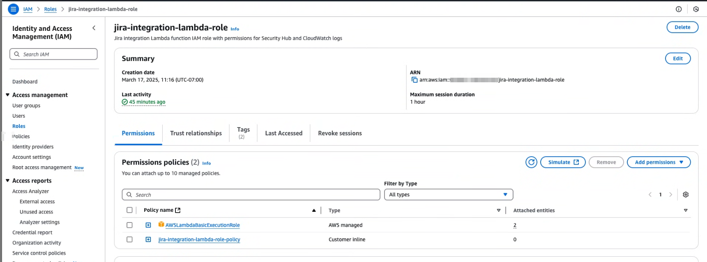

    - Check for lambda function created properly.

    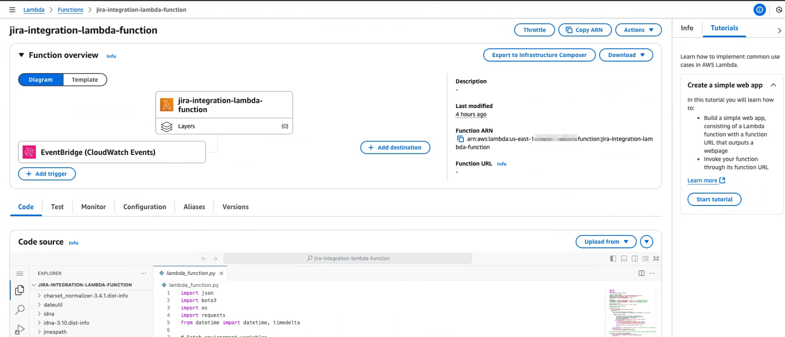

    - Check for lambda function code and all other dependencies files.

    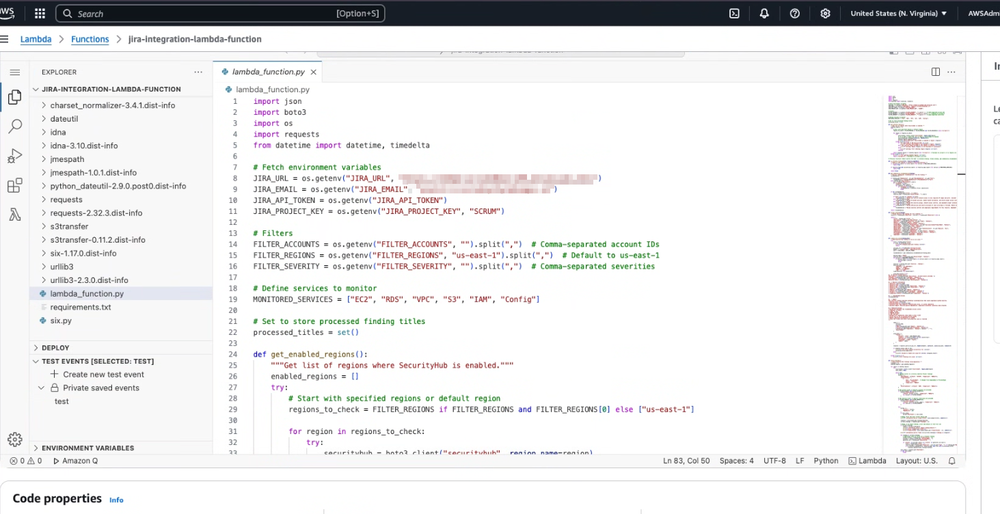

    - In lambda function , check configurations for permissions, if correct role is attached or not.

    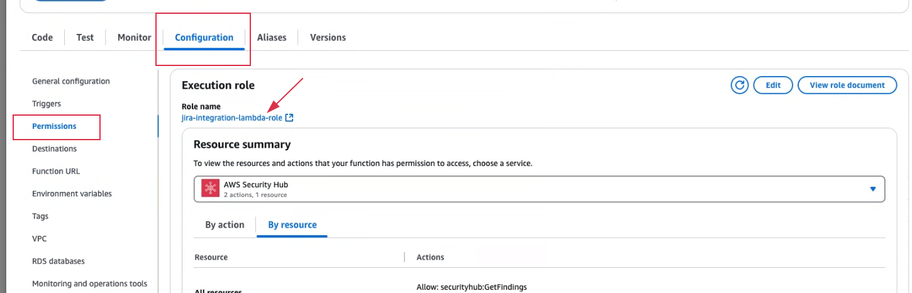

    - check for environment variables in lambda function (can also update manually for filters).

    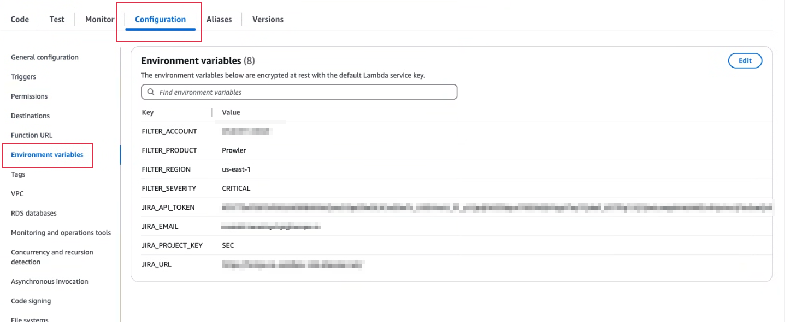

    - check for Event Bridge trigger in lambda function configurations.

    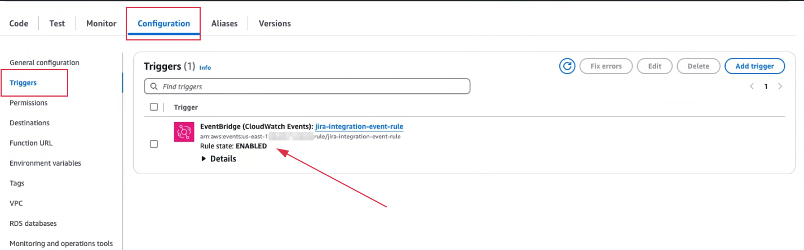

    - Trigger a Security Hub Finding: Create a finding matching the filter criteria and verify that the Lambda function creates a Jira ticket.

- ***Check CloudWatch Logs:*** Validate Lambda execution logs in CloudWatch.

- ***Jira Verification:*** Confirm that issues are created in the specified Jira project with correct details.

- ***NOTE:***  Trigger lambda code manually first time after deploy for sending old findings to jira, then for every new findings it will trigger automatically.

    - for trigger lambda function create an empty test event and invoke .

    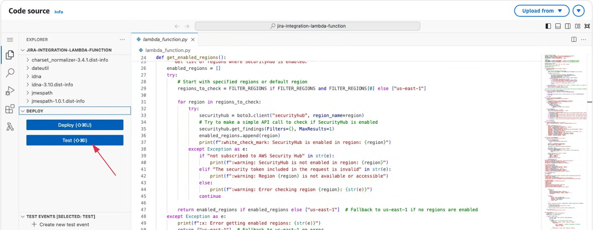

    - then check on Jira for new issues as per the filter in the all issues section from left panel.

    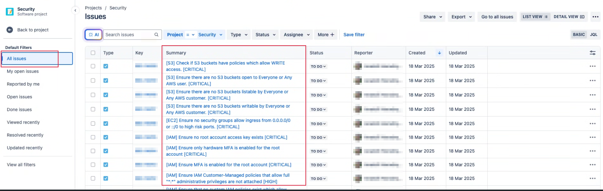

    - Jira issue will look like that.

    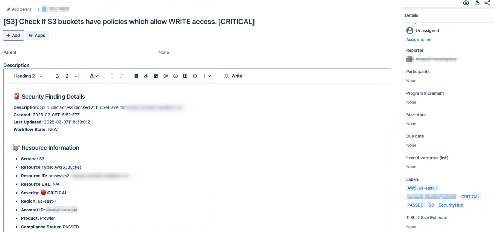
    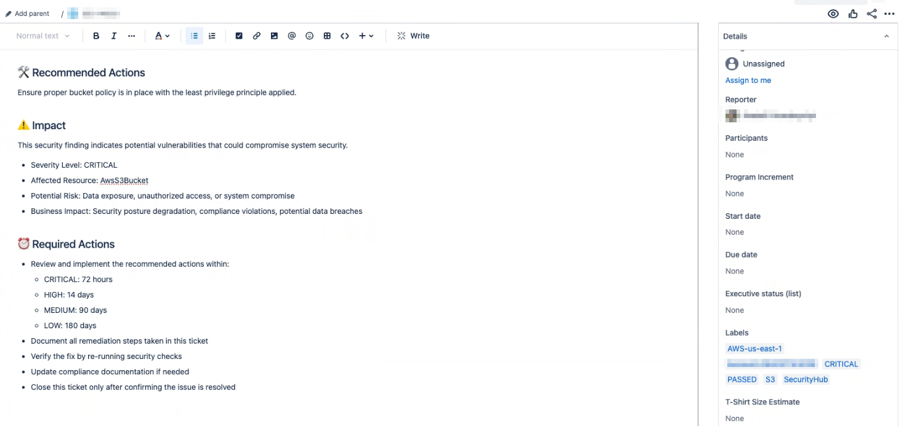
 

Now, with this seamless setup, Jira tickets will automatically appear in the Jira console under the designated epic—ensuring effortless tracking, better collaboration, and a streamlined workflow! 🚀
